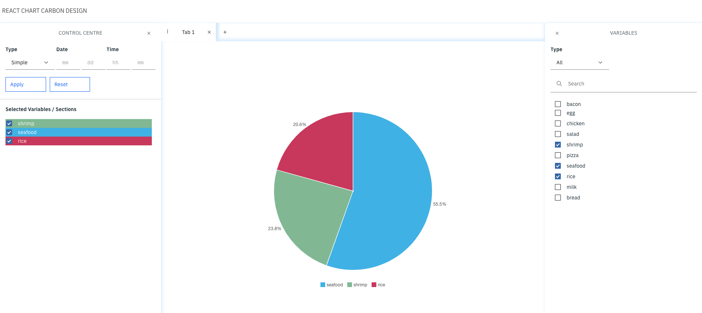

# REACT IBM CHART



## FE

- react
- redux
- redux thunk

## UI Component

- react carbon design

## Chart react carbon design

- d3: "^5.16.0",
- @carbon/charts": "^0.34.11",
- @carbon/charts-react": "^0.34.11",

## Libs

- axios
- styled component
- chroma-js
- oidc-client

## Tools

- husky
- lint-staged

## Config VSCode

### Install extensions

- ESLint
- Prettier
- EditorConfig for VS Code

### Edit settings.json file

Windows: Go to File -> Preferences -> Settings or `Ctrl + ,`

Adding in the settings.json file

```
{
  "files.associations": {
    "*.jsx": "javascriptreact"
  },
  "editor.wordWrap": "on",
  "editor.tabSize": 2,
  "editor.insertSpaces": true,
  "editor.detectIndentation": false,
  "editor.formatOnSave": true,
  "editor.codeActionsOnSave": {
    "source.fixAll.eslint": true
  }
}
```

## Git replacing CRLF to LF

```
$ git config --global core.autocrlf false
$ git rm --cached -r .
$ git reset --hard
```

## Scripts

```bash
# dev server with PORT 3002 at http://localhost:3009
$ npm start

# build for production with minify
$ npm run build

# run `lint` to tell you what is wrong code.
$ npm run lint

# run `format` to format all code based on your prettier and linting configuration.
$ npm run format
```
